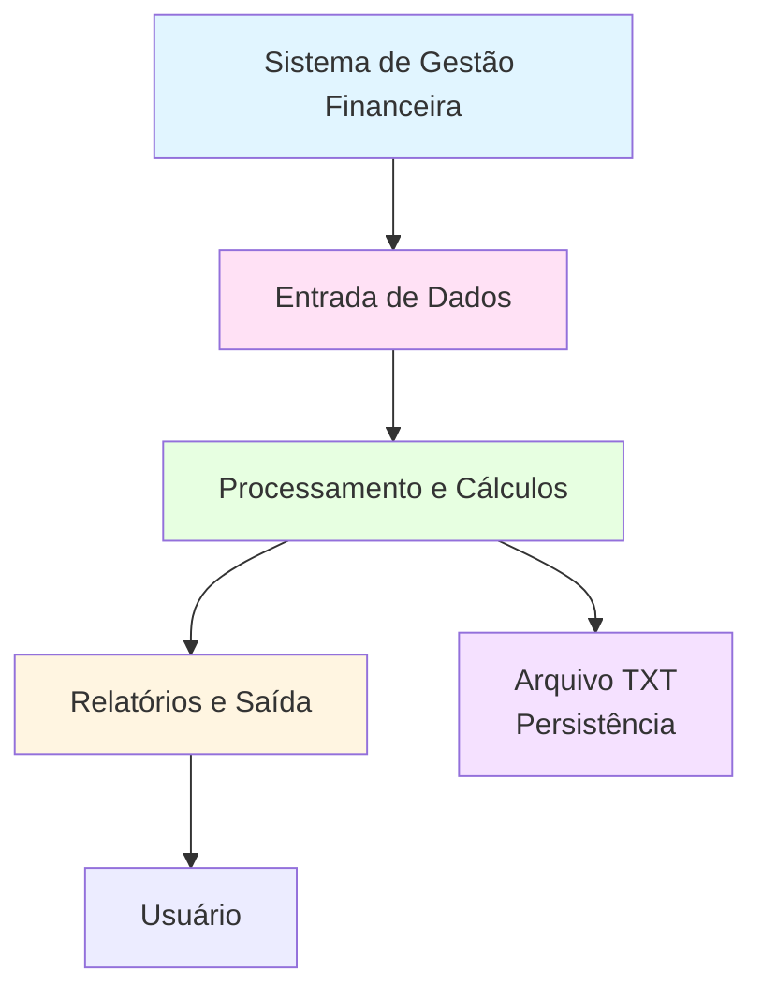

# Projeto 01: Sistema de Gestão Financeira Pessoal

1. Cabeçalho e Informações Básicas

# Nome do Projeto
**Disciplina:** Programação para Ciência de Dados
**Curso:** MBA Ciência de Dados - UNIFOR
**Instrutor:** Cássio Pinheiro
**Integrantes:**
- Jane Mery Ferreira de Miranda (2528376)
**Repositório GitHub:** https://github.com/janemery/projeto_01_gestao_financeira_pessoal
**Data de Entrega:** 14/11/2025

2. Objetivo do Projeto

Desenvolver um sistema simples de gestão financeira pessoal que permita registrar receitas e despesas, calcular saldo atual e gerar relatórios básicos usando apenas os conceitos fundamentais de Python.
Objetivo do Projeto

O projeto “Gestao Financeira Pessoal” tem como propósito criar uma ferramenta para controle financeiro pessoal, permitindo ao usuário registrar receitas e despesas, acompanhar saldos e analisar gastos por categoria.

Ele resolve o problema de falta de organização financeira, oferecendo uma forma estruturada de registrar transações, gerar relatórios e visualizar o saldo atual.

3. Diagrama de Contexto (Mermaid)



4. Funcionalidades Implementadas

1. **Cadastro de Transações**
   - Registrar receitas (descrição, valor, data)
   - Registrar despesas (descrição, valor, data, categoria)
   - Validar valores positivos

2. **Cálculos Financeiros**
   - Calcular saldo atual (receitas - despesas)
   - Calcular total de receitas por período
   - Calcular total de despesas por período
   - Calcular gastos por categoria

3. **Relatórios**
   - Exibir extrato de transações
   - Mostrar resumo financeiro (saldo, totais, categorias)
   - Filtrar transações por período ou categoria

4. **Persistência de Dados**
   - Salvar transações em arquivo TXT
   - Carregar transações do arquivo
   - Manter histórico de transações

5. Estrutura de Dados

### Entrada

```python
# Receita
receita = {
    'tipo': 'receita',
    'descricao': 'Salário',
    'valor': 5000.00,
    'data': '2024-01-15'
}

# Despesa
despesa = {
    'tipo': 'despesa',
    'descricao': 'Supermercado',
    'valor': 450.00,
    'data': '2024-01-20',
    'categoria': 'Alimentação'
}
```

### Saída

```python
# Lista de transações
transacoes = [
    {'tipo': 'receita', 'descricao': 'Salário', 'valor': 5000.00, 'data': '2024-01-15'},
    {'tipo': 'despesa', 'descricao': 'Supermercado', 'valor': 450.00, 'data': '2024-01-20', 'categoria': 'Alimentação'},
    # ... mais transações
]

# Relatório
relatorio = {
    'saldo_atual': 4550.00,
    'total_receitas': 5000.00,
    'total_despesas': 450.00,
    'gastos_por_categoria': {
        'Alimentação': 450.00,
        'Transporte': 200.00
    }
}
```

6. Requisitos Técnicos

- Python 3.8+
- Conhecimentos em:
  - Tipos de dados (int, float, str, dict, list)
  - Estruturas de controle (if/else, for, while)
  - Funções e documentação
  - Compreensões de lista e dicionário
  - Manipulação de arquivos (leitura/escrita)
  - Tratamento de erros básico

## 📦 Entregáveis

1. **Código Python** (`sistema_financeiro.py`)
   - Módulo principal com todas as funcionalidades
   - Funções bem documentadas
   - Tratamento de erros básico

2. **Arquivo de Dados** (`transacoes.txt`)
   - Formato estruturado para persistência
   - Exemplo com algumas transações

3. **Documentação** (`README.md`)
   - Como usar o sistema
   - Exemplos de uso

