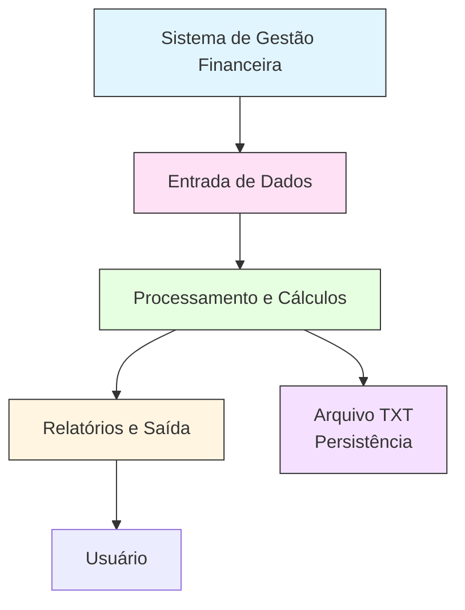

# 💰 Projeto 01: Sistema de Gestão Financeira Pessoal

## 1️⃣ Cabeçalho e Informações Básicas

**Nome do Projeto:** Sistema de Gestão Financeira Pessoal  
**Disciplina:** Programação para Ciência de Dados  
**Curso:** MBA Ciência de Dados - UNIFOR  
**Instrutor:** Cássio Pinheiro  
**Integrantes:** Jane Mery Ferreira de Miranda (2528376)  
**Repositório GitHub:** [📂 projeto_01_gestao_financeira_pessoal](https://github.com/janemery/projeto_01_gestao_financeira_pessoal)  
**Data de Entrega:** 14/11/2025  

**Público-alvo / Contexto de Aplicação:**  
Ferramenta de gestão financeira pessoal para registrar receitas e despesas, calcular saldo e gerar relatórios básicos.

---

## 2️⃣ Objetivo do Projeto

O projeto **Gestão Financeira Pessoal** tem como objetivo criar uma ferramenta para controle financeiro pessoal, permitindo ao usuário:

- 📝 Registrar receitas e despesas  
- 💵 Acompanhar saldos  
- 📊 Analisar gastos por categoria  
- 🧾 Gerar relatórios simples  

O sistema resolve o problema de **falta de organização financeira**, oferecendo uma forma estruturada de registrar transações, gerar relatórios e visualizar o saldo atual.

---

## 3️⃣ Diagrama de Contexto (Mermaid)


## 4️⃣ Funcionalidades Implementadas

- Cadastro de transações: receitas e despesas, validação de valores

- Cálculos financeiros: saldo atual, totais por período, gastos por categoria

- Relatórios: extrato, resumo financeiro, filtragem por período ou categoria

- Persistência: salvar e carregar transações em arquivo TXT

## 5️⃣ Estrutura de Dados
```python
# Receita
receita = {'tipo': 'receita', 'descricao': 'Salário', 'valor': 5000.00, 'data': '2024-01-15'}

# Despesa
despesa = {'tipo': 'despesa', 'descricao': 'Supermercado', 'valor': 450.00, 'data': '2024-01-20', 'categoria': 'Alimentação'}
```

## 6️⃣ Requisitos Técnicos

- Python 3.8+  
- Conhecimentos em:
  - Tipos de dados: `int`, `float`, `str`, `dict`, `list`  
  - Estruturas de controle: `if/else`, `for`, `while`  
  - Funções e documentação  
  - Compreensões de lista e dicionário  
  - Manipulação de arquivos (leitura/escrita)  
  - Tratamento de erros básico  

---

## 7️⃣ 📦 Entregáveis

1. **Código Python** (`sistema_financeiro.py`)  
2. **Arquivo de Dados** (`transacoes.txt`)  
3. **Documentação** (`README.md`)  

## 8️⃣ 🛠️ Como Usar o Sistema

Clone o repositório:
```
git clone https://github.com/janemery/projeto_01_gestao_financeira_pessoal.git
cd projeto_01_gestao_financeira_pessoal
```

Execute o sistema no terminal:
```
python main.py
```

Siga as instruções do menu para:

   - Registrar receitas e despesas

   - Consultar saldo e extratos

   - Filtrar relatórios por período ou categoria

## 9️⃣ 📌 Exemplos de Uso
Registrar Receita
Data: 15/01/2024
Tipo: Receita
Descrição: Salário
Valor: 5000

Registrar Despesa
Data: 20/01/2024
Tipo: Despesa
Descrição: Supermercado
Valor: 450
Categoria: Alimentação

Consultar Saldo e Extrato
Saldo Atual: R$ 4550,00
Extrato:
   - 15/01/2024: Salário (Receita) R$ 5000,00
   - 20/01/2024: Supermercado (Despesa) R$ 450,00