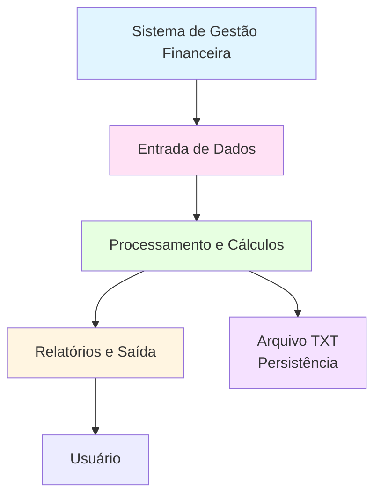

# Projeto 01: Sistema de Gestão Financeira Pessoal

1. Cabeçalho e Informações Básicas

# Nome do Projeto
**Disciplina:** Programação para Ciência de Dados
**Curso:** MBA Ciência de Dados - UNIFOR
**Instrutor:** Cássio Pinheiro
**Integrantes:**
- Jane Mery Ferreira de Miranda (2528376)
**Repositório GitHub:** https://github.com/janemery/projeto_01_gestao_financeira_pessoal
**Data de Entrega:** 14/11/2025

2. Objetivo do Projeto

Desenvolver um sistema simples de gestão financeira pessoal que permita registrar receitas e despesas, calcular saldo atual e gerar relatórios básicos usando apenas os conceitos fundamentais de Python.

3. Diagrama de Contexto (Mermaid)



4. Funcionalidades Implementadas

1. **Cadastro de Transações**
   - Registrar receitas (descrição, valor, data)
   - Registrar despesas (descrição, valor, data, categoria)
   - Validar valores positivos

2. **Cálculos Financeiros**
   - Calcular saldo atual (receitas - despesas)
   - Calcular total de receitas por período
   - Calcular total de despesas por período
   - Calcular gastos por categoria

3. **Relatórios**
   - Exibir extrato de transações
   - Mostrar resumo financeiro (saldo, totais, categorias)
   - Filtrar transações por período ou categoria

4. **Persistência de Dados**
   - Salvar transações em arquivo TXT
   - Carregar transações do arquivo
   - Manter histórico de transações

5. Estrutura de Dados

### Entrada

```python
# Receita
receita = {
    'tipo': 'receita',
    'descricao': 'Salário',
    'valor': 5000.00,
    'data': '2024-01-15'
}

# Despesa
despesa = {
    'tipo': 'despesa',
    'descricao': 'Supermercado',
    'valor': 450.00,
    'data': '2024-01-20',
    'categoria': 'Alimentação'
}
```

### Saída

```python
# Lista de transações
transacoes = [
    {'tipo': 'receita', 'descricao': 'Salário', 'valor': 5000.00, 'data': '2024-01-15'},
    {'tipo': 'despesa', 'descricao': 'Supermercado', 'valor': 450.00, 'data': '2024-01-20', 'categoria': 'Alimentação'},
    # ... mais transações
]

# Relatório
relatorio = {
    'saldo_atual': 4550.00,
    'total_receitas': 5000.00,
    'total_despesas': 450.00,
    'gastos_por_categoria': {
        'Alimentação': 450.00,
        'Transporte': 200.00
    }
}
```

6. Requisitos Técnicos

- Python 3.8+
- Conhecimentos em:
  - Tipos de dados (int, float, str, dict, list)
  - Estruturas de controle (if/else, for, while)
  - Funções e documentação
  - Compreensões de lista e dicionário
  - Manipulação de arquivos (leitura/escrita)
  - Tratamento de erros básico

## 📦 Entregáveis

1. **Código Python** (`sistema_financeiro.py`)
   - Módulo principal com todas as funcionalidades
   - Funções bem documentadas
   - Tratamento de erros básico

2. **Arquivo de Dados** (`transacoes.txt`)
   - Formato estruturado para persistência
   - Exemplo com algumas transações

3. **Relatório de Testes** (`testes.md`)
   - Cenários testados
   - Resultados obtidos

4. **Documentação** (`README.md`)
   - Como usar o sistema
   - Exemplos de uso

## 💡 Dicas

1. Use dicionários para representar transações
2. Use listas para armazenar múltiplas transações
3. Implemente funções para cada funcionalidade:
   - `adicionar_transacao()`
   - `calcular_saldo()`
   - `filtrar_por_categoria()`
   - `gerar_relatorio()`
   - `salvar_arquivo()`
   - `carregar_arquivo()`
4. Use list comprehension para filtrar transações
5. Use dict comprehension para agrupar por categoria
6. Formate números monetários com 2 casas decimais
7. Valide entradas do usuário antes de processar

## 🏗️ Esqueleto do Projeto

```python
# sistema_financeiro.py

# ============================================
# Sistema de Gestão Financeira Pessoal
# ============================================

transacoes = []  # Lista global para armazenar transações
arquivo_dados = "transacoes.txt"

# ============================================
# FUNÇÕES DE TRANSAÇÕES
# ============================================

def adicionar_transacao(tipo, descricao, valor, data, categoria=None):
    """
    Adiciona uma nova transação à lista.
    
    Args:
        tipo (str): 'receita' ou 'despesa'
        descricao (str): Descrição da transação
        valor (float): Valor da transação
        data (str): Data no formato 'YYYY-MM-DD'
        categoria (str, optional): Categoria da despesa
    
    Returns:
        dict: Transação criada
    """
    # TODO: Implementar validações
    # TODO: Criar dicionário da transação
    # TODO: Adicionar à lista
    # TODO: Retornar transação
    pass

def listar_transacoes(filtro_tipo=None, filtro_categoria=None):
    """
    Lista todas as transações com filtros opcionais.
    
    Args:
        filtro_tipo (str, optional): 'receita' ou 'despesa'
        filtro_categoria (str, optional): Nome da categoria
    
    Returns:
        list: Lista de transações filtradas
    """
    # TODO: Usar list comprehension para filtrar
    pass

# ============================================
# FUNÇÕES DE CÁLCULOS
# ============================================

def calcular_saldo():
    """
    Calcula o saldo atual (receitas - despesas).
    
    Returns:
        float: Saldo atual
    """
    # TODO: Separar receitas e despesas
    # TODO: Calcular totais
    # TODO: Retornar diferença
    pass

def calcular_total_por_tipo(tipo):
    """
    Calcula total de receitas ou despesas.
    
    Args:
        tipo (str): 'receita' ou 'despesa'
    
    Returns:
        float: Total do tipo especificado
    """
    # TODO: Filtrar por tipo
    # TODO: Somar valores
    pass

def calcular_gastos_por_categoria():
    """
    Calcula total de gastos agrupados por categoria.
    
    Returns:
        dict: Dicionário {categoria: total}
    """
    # TODO: Filtrar apenas despesas
    # TODO: Usar dict comprehension para agrupar
    pass

# ============================================
# FUNÇÕES DE RELATÓRIOS
# ============================================

def gerar_relatorio():
    """
    Gera relatório completo das finanças.
    
    Returns:
        dict: Dicionário com todas as informações
    """
    # TODO: Calcular todos os valores
    # TODO: Criar dicionário de relatório
    pass

def exibir_extrato():
    """
    Exibe extrato formatado de todas as transações.
    """
    # TODO: Iterar sobre transações
    # TODO: Formatar e exibir
    pass

# ============================================
# FUNÇÕES DE PERSISTÊNCIA
# ============================================

def salvar_arquivo():
    """
    Salva transações em arquivo TXT.
    """
    # TODO: Abrir arquivo em modo escrita
    # TODO: Converter transações para formato legível
    # TODO: Escrever no arquivo
    pass

def carregar_arquivo():
    """
    Carrega transações do arquivo TXT.
    """
    # TODO: Verificar se arquivo existe
    # TODO: Ler arquivo linha por linha
    # TODO: Converter de volta para dicionários
    # TODO: Adicionar à lista transacoes
    pass

# ============================================
# FUNÇÃO PRINCIPAL
# ============================================

def main():
    """
    Função principal do programa.
    """
    # TODO: Carregar dados do arquivo
    # TODO: Menu interativo
    # TODO: Opções: adicionar, listar, relatório, salvar, sair
    pass

if __name__ == "__main__":
    main()
```

## 📝 Exemplo de Uso

```python
# Exemplo de uso do sistema

# Adicionar uma receita
adicionar_transacao(
    tipo='receita',
    descricao='Salário Janeiro',
    valor=5000.00,
    data='2024-01-05'
)

# Adicionar uma despesa
adicionar_transacao(
    tipo='despesa',
    descricao='Supermercado',
    valor=450.00,
    data='2024-01-10',
    categoria='Alimentação'
)

# Gerar relatório
relatorio = gerar_relatorio()
print(f"Saldo atual: R$ {relatorio['saldo_atual']:.2f}")

# Salvar em arquivo
salvar_arquivo()
```

